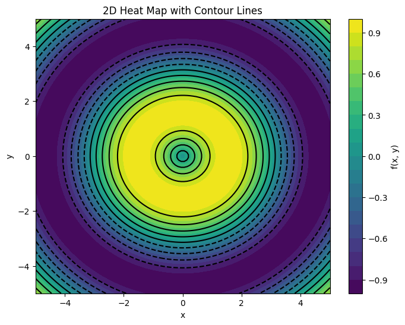

2026-07-29

# Example

2026-07-29

*Showcasing the awesome stuff made possible by `boopiter`*

``` python
import matplotlib.pyplot as plt
import tqdm.auto as tqdm
```

<div class="boopcell boop-note">

## Plots

</div>

<div class="boopcell boop-prompt">

Hey, could you generate some really brief simple code that would plot a
2D heat map with contour lines for some function you might make up?
Matplotlib is fine.

##### 🤖Reply🤖<!-- SOLVEIT_SEPARATOR_4c63a2ab -->

<details onclick="event.stopPropagation()" class="text-gray-400">

<summary>

Reply details
</summary>

<ul>

<li>

Model: qwen2.5-coder:latest
</li>

<li>

Finish reason: stop
</li>

<li>

Tokens: 1204 prompt + 244 completion = 1448 total
</li>

</ul>

</details>

Certainly! Here’s a snippet of Python code that generates a 2D heatmap
with contour lines using Matplotlib:

``` python
import numpy as np
import matplotlib.pyplot as plt

# Define the function to plot
def f(x, y):
    return np.sin(np.sqrt(x**2 + y**2))

# Generate data
x = np.linspace(-5, 5, 100)
y = np.linspace(-5, 5, 100)
X, Y = np.meshgrid(x, y)
Z = f(X, Y)

# Create the plot
plt.figure(figsize=(8, 6))
plt.contourf(X, Y, Z, levels=20, cmap='viridis')
plt.colorbar(label='f(x, y)')
plt.contour(X, Y, Z, colors='black', levels=10)
plt.xlabel('x')
plt.ylabel('y')
plt.title('2D Heat Map with Contour Lines')
plt.show()
```

This code defines a simple function `f` and then uses Matplotlib to
create a heatmap of this function along with contour lines. You can run
this in your Python environment to see the plot.

</div>

``` python
import numpy as np
import matplotlib.pyplot as plt

# Define the function to plot
def f(x, y):
    return np.sin(np.sqrt(x**2 + y**2))

# Generate data
x = np.linspace(-5, 5, 100)
y = np.linspace(-5, 5, 100)
X, Y = np.meshgrid(x, y)
Z = f(X, Y)

# Create the plot
plt.figure(figsize=(8, 6))
plt.contourf(X, Y, Z, levels=20, cmap='viridis')
plt.colorbar(label='f(x, y)')
plt.contour(X, Y, Z, colors='black', levels=10)
plt.xlabel('x')
plt.ylabel('y')
plt.title('2D Heat Map with Contour Lines')
plt.show()
```

    <ipython-input-1-6356375be1f3>:22: UserWarning: FigureCanvasAgg is non-interactive, and thus cannot be shown
      plt.show()



<div class="boopcell boop-note">

## Progress Bars

We can only use the regular TQDM as if we were in a terminal because the
notebook version requires IPy widgets that I’m not going to implement

</div>

``` python
from tqdm import tqdm
import time

for i in tqdm(range(1000)):
    time.sleep(0.01)  # Simulate some work being done
```

    100%|##########| 1000/1000 [00:13<00:00, 72.47it/s]

<div class="boopcell boop-note">

Notice how the notebook version isn’t going to increment. So be aware.

</div>

``` python
from tqdm.notebook import tqdm
import time

for i in tqdm(range(1000)):
    time.sleep(0.01)  # Simulate some work being done
```

      0%|          | 0/1000 [00:00<?, ?it/s]

<div class="boopcell boop-note">

…See it just sits there and does nothing. So *don’t try to use the
notebook version.*

Good news is, if you just use the auto version of TQDM, you get the
regular text version:

</div>

``` python
from tqdm.auto import tqdm
import time

for i in tqdm(range(1000)):
    time.sleep(0.01)  # Simulate some work being done
```

    100%|##########| 1000/1000 [00:12<00:00, 82.16it/s]

<div class="boopcell boop-prompt">

Which variety of which LLM are you?

##### 🤖Reply🤖<!-- SOLVEIT_SEPARATOR_1c03a0b4 -->

<details onclick="event.stopPropagation()" class="text-gray-400">

<summary>

Reply details
</summary>

<ul>

<li>

Model: qwen2.5-coder:latest
</li>

<li>

Finish reason: stop
</li>

<li>

Tokens: 1866 prompt + 63 completion = 1929 total
</li>

</ul>

</details>

I am Qwen, a large language model created by Alibaba Cloud. My base
architecture is based on transformer models and I have been trained on a
diverse dataset to understand and generate human-like text on a wide
range of topics. If you have any questions or need assistance with
anything specific, feel free to ask!

</div>

<div class="boopcell boop-prompt">

I’m wondering if you could give me a little code that would generate
like a 3D scatter plot in Plotly that I can test here in this Boopiter
notebook. I suppose I’ll have to render it via the IPython display HTML
element, so give me your best guess at what that needs to look like. And
please conform to my coding style of keeping everything as vertically
compact as possible so that I don’t have to scroll up and down much to
see the full code

##### 🤖Reply🤖<!-- SOLVEIT_SEPARATOR_63d31e79 -->

<details onclick="event.stopPropagation()" class="text-gray-400">

<summary>

Reply details
</summary>

<ul>

<li>

Model: Claude Opus 4.8 (dead drop)
</li>

</ul>

</details>

Compact as requested. One change with a purpose, though: I wrapped it in
an `<iframe srcdoc=...>` instead of a bare
`display(HTML(fig.to_html(...)))`.

``` python
import numpy as np, plotly.graph_objs as go
from IPython.display import display, HTML
np.random.seed(42); n = 100
x, y = np.random.rand(2, n)*2 - 1; z = np.hypot(x, y)
fig = go.Figure(go.Scatter3d(x=x, y=y, z=z, mode='markers',
    marker=dict(size=5, color=z, colorscale='Viridis', opacity=.8)))
fig.update_layout(title='3D Scatter', margin=dict(l=0, r=0, b=0, t=30),
    scene=dict(xaxis_title='X', yaxis_title='Y', zaxis_title='Z'))
h = fig.to_html(include_plotlyjs='cdn', full_html=True).replace('&','&amp;').replace('"','&quot;')
display({'text/html': f'<iframe srcdoc="{h}" width="100%" height="500" style="border:none"></iframe>'}, raw=True)</iframe>'))
```

Why the iframe: raw Plotly HTML *leads with* `<script>` tags, and the
docs generator (Quarto/Pandoc) lifts a raw-HTML block that starts with
`<script>` up out of the page flow – which is why, on the doc site, the
plot detaches from its cell and jumps to the top (and two plots would
collide up there). An `<iframe>` is a single inline element with the
whole plot sealed inside its `srcdoc`, so there’s nothing to hoist – it
renders right under the code, in the notebook *and* on the docs page.

Bonus: `include_plotlyjs='cdn'` pulls plotly.js from the CDN instead of
inlining ~4.8MB of library into every output – so the cell (and the
committed notebook) stays tiny.

</div>

``` python
import numpy as np, plotly.graph_objs as go
from IPython.display import display
np.random.seed(42); n = 100
x, y = np.random.rand(2, n)*2 - 1; z = np.hypot(x, y)
fig = go.Figure(go.Scatter3d(x=x, y=y, z=z, mode='markers',
    marker=dict(size=5, color=z, colorscale='Viridis', opacity=.8)))
fig.update_layout(title='3D Scatter', margin=dict(l=0, r=0, b=0, t=30),
    scene=dict(xaxis_title='X', yaxis_title='Y', zaxis_title='Z'))
h = fig.to_html(include_plotlyjs='cdn', full_html=True).replace('&','&amp;').replace('"','&quot;')
display({'text/html': f'<iframe srcdoc="{h}" width="100%" height="500" style="border:none"></iframe>'}, raw=True)
```

<iframe srcdoc="&lt;html&gt;
&lt;head&gt;&lt;meta charset=&quot;utf-8&quot; /&gt;&lt;/head&gt;
&lt;body&gt;
    &lt;div style=&quot;height:100%; width:100%;&quot;&gt;                        &lt;script&gt;window.PlotlyConfig = {MathJaxConfig: &#39;local&#39;};&lt;/script&gt;
        &lt;script charset=&quot;utf-8&quot; src=&quot;https://cdn.plot.ly/plotly-3.7.0.min.js&quot; integrity=&quot;sha256-jvTGqxNp8AGWEcvNLVuKr+8j5dGe9Yw51LQkmDH+IYA=&quot; crossorigin=&quot;anonymous&quot;&gt;&lt;/script&gt;                &lt;div id=&quot;e2ac2fee-103d-4e42-89dd-27c9f50cbedd&quot; class=&quot;plotly-graph-div&quot; style=&quot;height:100%; width:100%;&quot;&gt;&lt;/div&gt;            &lt;script&gt;                window.PLOTLYENV=window.PLOTLYENV || {};                                if (document.getElementById(&quot;e2ac2fee-103d-4e42-89dd-27c9f50cbedd&quot;)) {                    Plotly.newPlot(                        &quot;e2ac2fee-103d-4e42-89dd-27c9f50cbedd&quot;,                        [{&quot;marker&quot;:{&quot;color&quot;:{&quot;dtype&quot;:&quot;f8&quot;,&quot;bdata&quot;:&quot;u2zie3wL7z9i9Uw+TSPuP8Zc8gskBOM\u002fV5oovwhayT96SgvC+xDxPxv7sXopPus\u002fE79nh7zb7D\u002f8FOtt\u002fZPsP8bHglAphuI\u002fz7SO0c0r7j97N0TnccDwP3t2vSmcifI\u002fZMsnb5Zi8T9LRo0NVvrqPx\u002fy7eekFOY\u002fxap7WJg87z8pNqTYih\u002fnP0lyytk6H+Q\u002fXhf3Lp9\u002f6T8GEiTkaTHbP1oFoFMc8OQ\u002fHkSGfIYj8T+hYBOFc67hP52xyQ+uYeo\u002fmrXntj6j4T8SniC8idbiPytVycKO\u002fus\u002f5VPfOM8a5z\u002fhW5m2Yg3wP3UUttkKCe0\u002fk4nQFUdb0T\u002fzBEXL1ZXrP2YqYy0hfPI\u002ftkt7vviM7j\u002f2vBlHe5D0P+q3WcIvwOY\u002fYP4WsPQf2T9eS0F1btfsP8EH67nbVt0\u002fz+iOT59v7j8dXrzetBzzP2K6IA8ix98\u002fjJHqL7bM7T\u002fLJETVvCHtP5m249jgr+Q\u002fy9A\u002fT09p7z++Z\u002fg1ZOLbPzDebpRhu6Q\u002f8sVoo1Dc7D\u002f+S6BRvKXoP5zmTZNx6fM\u002f0Yk\u002fMA0\u002f6D\u002fdGvPsuRTyP7esErYoR+k\u002fvH4oNvW07z+4Nfyqm6XvP53CHRk9jOw\u002fQE2yOGur6T+QYGBHA83wP517nBCTZOI\u002f8VzMO6gf1j\u002fZSP29K+jgP4RExqJmteY\u002fN3qzJRPm0j8lkq8h\u002fbvtP4H8wHD0oeU\u002f6k8VyCyv6T+vCHCy+t3rP539lllQCPQ\u002f6i0Xr\u002fey7z94Ks9YVs3kPy8hkyRGOvI\u002f+yb4s\u002fKn7z9U1tNdmbjqP784mG59LOA\u002f2WshVm166T\u002f3N3ekEDvlPy3s\u002fltdNew\u002fYkH4cMFh7T8RWLYypebwP4dnXOYEXuk\u002fM4\u002fAjj736T+1CBbpekHtP11gvcFWdvI\u002f\u002fOkO08en4z+gEyLfGVXeP4Ec2avwD+k\u002ffcbdBOD40j+7o76GqtroP4UMI5rrneA\u002fyPOMhyDT8T9PY\u002fkFgtrsP4Bm5qAkle4\u002fiTI1fnrB0j+5xmVfzyvkP3EotA9IUdM\u002fGKV0OX4R3T8rlb0nrdXpPyc7isn5mPM\u002fyRCJPu7U7j8=&quot;},&quot;colorscale&quot;:[[0.0,&quot;#440154&quot;],[0.1111111111111111,&quot;#482878&quot;],[0.2222222222222222,&quot;#3e4989&quot;],[0.3333333333333333,&quot;#31688e&quot;],[0.4444444444444444,&quot;#26828e&quot;],[0.5555555555555556,&quot;#1f9e89&quot;],[0.6666666666666666,&quot;#35b779&quot;],[0.7777777777777778,&quot;#6ece58&quot;],[0.8888888888888888,&quot;#b5de2b&quot;],[1.0,&quot;#fde725&quot;]],&quot;opacity&quot;:0.8,&quot;size&quot;:5},&quot;mode&quot;:&quot;markers&quot;,&quot;x&quot;:{&quot;dtype&quot;:&quot;f8&quot;,&quot;bdata&quot;:&quot;KFxBwxEP0L+orHfRgNjsP0SdeTz6sd0\u002fgGUZs65ByT8+725kygPmv1pAM48vBOa\u002fUnVTrFtI7L9qb6sSbm\u002fnP2hdkmSs4sk\u002fCApqSh+i2j8YeIxfvq7uv0qnxsUAE+4\u002f7CeCf71G5T+0Z\u002f43CWniv2TzD9D6XOS\u002f3GUPuxlD5L8wqzYWlw7Zv2CM5wDAWak\u002fmBJDHw1swb\u002fkhZrnALnavzipyyxkosw\u002fwm2gV4gS579Yf2sQAZvav5CRRhwOG9G\u002fIIEzuv59tr9cdPKsUkDiP8a38HSLOOO\u002fwAS1+\u002fEmnT+4uO8ue6jHP5LXHtn0Bu2\u002fUBTFNQ+Iyz+mYGX8IRblv1jV5Ncx1uu\u002fEqGJZ4q67D9AnYFM6sztPz5VFTvIvOM\u002fLJq+f2oC2b8kISd2vb\u002fpv4Q926PylNc\u002fIGlFFFWkvr8Uuh6LhjDovwB6Z1VgwYO\u002fAPOcFpTM7b9i5CAzTjLqP6CPFS1M4N6\u002f2PUVvIfN1D\u002fEjzL52RnYvwDVnRq2jKQ\u002fwDNV5Gjqtz\u002fS3r83WCvkv8z\u002fvK6sDe4\u002fsBiZs8ab4T+GRCkrwCDsPx7Mae\u002fZROk\u002f6M9FF\u002fkPyT9owZzK\u002fP\u002fqPxK7b4sjVuq\u002f2lTVSwR1478MhU8A\u002fxrtvxTKfGKTW9a\u002fKPQVKKV\u002fzL\u002fMa11Xb0Tdv5iqsQwJCuU\u002fdFCOMOhV0r94lkmGVgrcv3D4qdFC3LU\u002fXDuh9Rj75r94d1IBMlfjPwb63++POuu\u002fUCBj0ycp7z+ktyhTdWzhP6zvpgU+SOO\u002fICrjj4al77+uOpchhTDkPxioYStNeto\u002fGI+kXBtQ3T+KAdlMflzhP5LvljjaQuu\u002fRDCVhcsd0r+gKa7wmZXovwbhzCYWPec\u002fYOZhTneQzz9AM3kuIqXVv3KQCPWo7uu\u002fIG1MNbsx2L\u002fQYViVZGDWv6j0dTm8Y90\u002frEJltHub0T8wbX30F8joP6BA\u002fM6wc6y\u002fBO85YJFY6L+oJpXtmkvbPyAaxsWzsOA\u002fcGAaj7lfvz+MbQy6hlfhPwBKTOvJaYm\u002fYAD3WkZHpz8YlXP8q4zCvyY9fHSIX+6\u002fDOFijk4Y6b8=&quot;},&quot;y&quot;:{&quot;dtype&quot;:&quot;f8&quot;,&quot;bdata&quot;:&quot;5nnVcBD97b\u002fMHZt35XXRP8TS\u002fOYuw9e\u002fgFcNsoKNkT\u002fOWR2xkRXqPzonKpuYC+C\u002fMJ+5DiXxxr+Q3p8p81rgPzAJdfBeW+G\u002fBoY128IS6780KeKkbOnav0jN9OiMruW\u002fVK3+lCqA6z8wdV2KPrjjP7wasNFfE9E\u002fmPumowLG5z+yXb8BXW\u002fjP9b8qnQ8D+S\u002fPPUQx68f6T+QEcKUqiS0Pz4J+ngZreM\u002frrLZUo9Z6T94oX2BqUvXv1Ss0sXo9Oi\u002f2IfRooJp4b+4vPtfEKnCv54P0ppaWuQ\u002fKDFwujUW5z\u002fqyK6mGI7vv4AVuoiuApY\u002f4EV8cI0kxb8a5HVS\u002fMjhv1o+2DUgVOi\u002f2A8YrAbJ1L\u002f4qFjxoVjsPxjxf0xJoda\u002f4OJvR9k9oz\u002foHHZ2hvzZP5Az9s6VdNG\u002fzAQIeq0x7j8omvmJvJjtPxDw2wSZxd+\u002fAIqiJk2Kdr+cb6HN0XzZv0hBCcBYitu\u002f7KHd7aSj7b8AbkB\u002faAzMPwDj5qRR8nU\u002f5k+8d5K07L+UlnoKUFXcv8wmEz0HIeo\u002fTuqNmgSr4L9gpcDbCrrmv0AVXo3KmZW\u002fNlNspOUU7z86KEKbKoLgv9gsS6GJCNY\u002fZA31MmC+4D90DhDmi8rgvxCp2XwxNt0\u002fDKZ5eHvs0L\u002fkGby\u002fZe\u002fQP7yVYWaAF9E\u002fcGtANA9Rsj88\u002fZxBsTjqv2arNJmYdeU\u002f+Grex63w1r+y+W6qFBDkv8gUIqnwY+2\u002fWEFuisJExz94G4bTbbrWP9aQT5o58O6\u002fwHU7zz7EmD+c7jXdF4Hhv2zwiaEFldI\u002f8s55MC7X5L94dFzWpXDYP8CUbo\u002fp\u002fsy\u002fWqGzVmLz6z\u002fIL5ha2zLnvwiOPBTwV9S\u002fRNJTjtm86L+s4lQkLi7rP2j3kPVTJug\u002f8NtXzMT73r+IncxyW3rUPxJ721deTeQ\u002f8I8Q4UdDvD+g2WKhuFyuPySsB\u002fh9heC\u002fOtJGsJoK6r+OYnek+2vpP6SjDw9zoOk\u002fvPEE83cJ0T80von7q5rUv5hVy8QZTdO\u002fjOyLnR3s3D+MwNkmQWrpP8BuPCMGxug\u002fNCcaH3vp4T8=&quot;},&quot;z&quot;:{&quot;dtype&quot;:&quot;f8&quot;,&quot;bdata&quot;:&quot;u2zie3wL7z9i9Uw+TSPuP8Zc8gskBOM\u002fV5oovwhayT96SgvC+xDxPxv7sXopPus\u002fE79nh7zb7D\u002f8FOtt\u002fZPsP8bHglAphuI\u002fz7SO0c0r7j97N0TnccDwP3t2vSmcifI\u002fZMsnb5Zi8T9LRo0NVvrqPx\u002fy7eekFOY\u002fxap7WJg87z8pNqTYih\u002fnP0lyytk6H+Q\u002fXhf3Lp9\u002f6T8GEiTkaTHbP1oFoFMc8OQ\u002fHkSGfIYj8T+hYBOFc67hP52xyQ+uYeo\u002fmrXntj6j4T8SniC8idbiPytVycKO\u002fus\u002f5VPfOM8a5z\u002fhW5m2Yg3wP3UUttkKCe0\u002fk4nQFUdb0T\u002fzBEXL1ZXrP2YqYy0hfPI\u002ftkt7vviM7j\u002f2vBlHe5D0P+q3WcIvwOY\u002fYP4WsPQf2T9eS0F1btfsP8EH67nbVt0\u002fz+iOT59v7j8dXrzetBzzP2K6IA8ix98\u002fjJHqL7bM7T\u002fLJETVvCHtP5m249jgr+Q\u002fy9A\u002fT09p7z++Z\u002fg1ZOLbPzDebpRhu6Q\u002f8sVoo1Dc7D\u002f+S6BRvKXoP5zmTZNx6fM\u002f0Yk\u002fMA0\u002f6D\u002fdGvPsuRTyP7esErYoR+k\u002fvH4oNvW07z+4Nfyqm6XvP53CHRk9jOw\u002fQE2yOGur6T+QYGBHA83wP517nBCTZOI\u002f8VzMO6gf1j\u002fZSP29K+jgP4RExqJmteY\u002fN3qzJRPm0j8lkq8h\u002fbvtP4H8wHD0oeU\u002f6k8VyCyv6T+vCHCy+t3rP539lllQCPQ\u002f6i0Xr\u002fey7z94Ks9YVs3kPy8hkyRGOvI\u002f+yb4s\u002fKn7z9U1tNdmbjqP784mG59LOA\u002f2WshVm166T\u002f3N3ekEDvlPy3s\u002fltdNew\u002fYkH4cMFh7T8RWLYypebwP4dnXOYEXuk\u002fM4\u002fAjj736T+1CBbpekHtP11gvcFWdvI\u002f\u002fOkO08en4z+gEyLfGVXeP4Ec2avwD+k\u002ffcbdBOD40j+7o76GqtroP4UMI5rrneA\u002fyPOMhyDT8T9PY\u002fkFgtrsP4Bm5qAkle4\u002fiTI1fnrB0j+5xmVfzyvkP3EotA9IUdM\u002fGKV0OX4R3T8rlb0nrdXpPyc7isn5mPM\u002fyRCJPu7U7j8=&quot;},&quot;type&quot;:&quot;scatter3d&quot;}],                        {&quot;template&quot;:{&quot;data&quot;:{&quot;histogram2dcontour&quot;:[{&quot;type&quot;:&quot;histogram2dcontour&quot;,&quot;colorbar&quot;:{&quot;outlinewidth&quot;:0,&quot;ticks&quot;:&quot;&quot;},&quot;colorscale&quot;:[[0.0,&quot;#0d0887&quot;],[0.1111111111111111,&quot;#46039f&quot;],[0.2222222222222222,&quot;#7201a8&quot;],[0.3333333333333333,&quot;#9c179e&quot;],[0.4444444444444444,&quot;#bd3786&quot;],[0.5555555555555556,&quot;#d8576b&quot;],[0.6666666666666666,&quot;#ed7953&quot;],[0.7777777777777778,&quot;#fb9f3a&quot;],[0.8888888888888888,&quot;#fdca26&quot;],[1.0,&quot;#f0f921&quot;]]}],&quot;choropleth&quot;:[{&quot;type&quot;:&quot;choropleth&quot;,&quot;colorbar&quot;:{&quot;outlinewidth&quot;:0,&quot;ticks&quot;:&quot;&quot;}}],&quot;histogram2d&quot;:[{&quot;type&quot;:&quot;histogram2d&quot;,&quot;colorbar&quot;:{&quot;outlinewidth&quot;:0,&quot;ticks&quot;:&quot;&quot;},&quot;colorscale&quot;:[[0.0,&quot;#0d0887&quot;],[0.1111111111111111,&quot;#46039f&quot;],[0.2222222222222222,&quot;#7201a8&quot;],[0.3333333333333333,&quot;#9c179e&quot;],[0.4444444444444444,&quot;#bd3786&quot;],[0.5555555555555556,&quot;#d8576b&quot;],[0.6666666666666666,&quot;#ed7953&quot;],[0.7777777777777778,&quot;#fb9f3a&quot;],[0.8888888888888888,&quot;#fdca26&quot;],[1.0,&quot;#f0f921&quot;]]}],&quot;heatmap&quot;:[{&quot;type&quot;:&quot;heatmap&quot;,&quot;colorbar&quot;:{&quot;outlinewidth&quot;:0,&quot;ticks&quot;:&quot;&quot;},&quot;colorscale&quot;:[[0.0,&quot;#0d0887&quot;],[0.1111111111111111,&quot;#46039f&quot;],[0.2222222222222222,&quot;#7201a8&quot;],[0.3333333333333333,&quot;#9c179e&quot;],[0.4444444444444444,&quot;#bd3786&quot;],[0.5555555555555556,&quot;#d8576b&quot;],[0.6666666666666666,&quot;#ed7953&quot;],[0.7777777777777778,&quot;#fb9f3a&quot;],[0.8888888888888888,&quot;#fdca26&quot;],[1.0,&quot;#f0f921&quot;]]}],&quot;contourcarpet&quot;:[{&quot;type&quot;:&quot;contourcarpet&quot;,&quot;colorbar&quot;:{&quot;outlinewidth&quot;:0,&quot;ticks&quot;:&quot;&quot;}}],&quot;contour&quot;:[{&quot;type&quot;:&quot;contour&quot;,&quot;colorbar&quot;:{&quot;outlinewidth&quot;:0,&quot;ticks&quot;:&quot;&quot;},&quot;colorscale&quot;:[[0.0,&quot;#0d0887&quot;],[0.1111111111111111,&quot;#46039f&quot;],[0.2222222222222222,&quot;#7201a8&quot;],[0.3333333333333333,&quot;#9c179e&quot;],[0.4444444444444444,&quot;#bd3786&quot;],[0.5555555555555556,&quot;#d8576b&quot;],[0.6666666666666666,&quot;#ed7953&quot;],[0.7777777777777778,&quot;#fb9f3a&quot;],[0.8888888888888888,&quot;#fdca26&quot;],[1.0,&quot;#f0f921&quot;]]}],&quot;surface&quot;:[{&quot;type&quot;:&quot;surface&quot;,&quot;colorbar&quot;:{&quot;outlinewidth&quot;:0,&quot;ticks&quot;:&quot;&quot;},&quot;colorscale&quot;:[[0.0,&quot;#0d0887&quot;],[0.1111111111111111,&quot;#46039f&quot;],[0.2222222222222222,&quot;#7201a8&quot;],[0.3333333333333333,&quot;#9c179e&quot;],[0.4444444444444444,&quot;#bd3786&quot;],[0.5555555555555556,&quot;#d8576b&quot;],[0.6666666666666666,&quot;#ed7953&quot;],[0.7777777777777778,&quot;#fb9f3a&quot;],[0.8888888888888888,&quot;#fdca26&quot;],[1.0,&quot;#f0f921&quot;]]}],&quot;mesh3d&quot;:[{&quot;type&quot;:&quot;mesh3d&quot;,&quot;colorbar&quot;:{&quot;outlinewidth&quot;:0,&quot;ticks&quot;:&quot;&quot;}}],&quot;scatter&quot;:[{&quot;fillpattern&quot;:{&quot;fillmode&quot;:&quot;overlay&quot;,&quot;size&quot;:10,&quot;solidity&quot;:0.2},&quot;type&quot;:&quot;scatter&quot;}],&quot;parcoords&quot;:[{&quot;type&quot;:&quot;parcoords&quot;,&quot;line&quot;:{&quot;colorbar&quot;:{&quot;outlinewidth&quot;:0,&quot;ticks&quot;:&quot;&quot;}}}],&quot;scatterpolargl&quot;:[{&quot;type&quot;:&quot;scatterpolargl&quot;,&quot;marker&quot;:{&quot;colorbar&quot;:{&quot;outlinewidth&quot;:0,&quot;ticks&quot;:&quot;&quot;}}}],&quot;bar&quot;:[{&quot;error_x&quot;:{&quot;color&quot;:&quot;#2a3f5f&quot;},&quot;error_y&quot;:{&quot;color&quot;:&quot;#2a3f5f&quot;},&quot;marker&quot;:{&quot;line&quot;:{&quot;color&quot;:&quot;#E5ECF6&quot;,&quot;width&quot;:0.5},&quot;pattern&quot;:{&quot;fillmode&quot;:&quot;overlay&quot;,&quot;size&quot;:10,&quot;solidity&quot;:0.2}},&quot;type&quot;:&quot;bar&quot;}],&quot;scattergeo&quot;:[{&quot;type&quot;:&quot;scattergeo&quot;,&quot;marker&quot;:{&quot;colorbar&quot;:{&quot;outlinewidth&quot;:0,&quot;ticks&quot;:&quot;&quot;}}}],&quot;scatterpolar&quot;:[{&quot;type&quot;:&quot;scatterpolar&quot;,&quot;marker&quot;:{&quot;colorbar&quot;:{&quot;outlinewidth&quot;:0,&quot;ticks&quot;:&quot;&quot;}}}],&quot;histogram&quot;:[{&quot;marker&quot;:{&quot;pattern&quot;:{&quot;fillmode&quot;:&quot;overlay&quot;,&quot;size&quot;:10,&quot;solidity&quot;:0.2}},&quot;type&quot;:&quot;histogram&quot;}],&quot;scattergl&quot;:[{&quot;type&quot;:&quot;scattergl&quot;,&quot;marker&quot;:{&quot;colorbar&quot;:{&quot;outlinewidth&quot;:0,&quot;ticks&quot;:&quot;&quot;}}}],&quot;scatter3d&quot;:[{&quot;type&quot;:&quot;scatter3d&quot;,&quot;line&quot;:{&quot;colorbar&quot;:{&quot;outlinewidth&quot;:0,&quot;ticks&quot;:&quot;&quot;}},&quot;marker&quot;:{&quot;colorbar&quot;:{&quot;outlinewidth&quot;:0,&quot;ticks&quot;:&quot;&quot;}}}],&quot;scattermap&quot;:[{&quot;type&quot;:&quot;scattermap&quot;,&quot;marker&quot;:{&quot;colorbar&quot;:{&quot;outlinewidth&quot;:0,&quot;ticks&quot;:&quot;&quot;}}}],&quot;scattermapbox&quot;:[{&quot;type&quot;:&quot;scattermapbox&quot;,&quot;marker&quot;:{&quot;colorbar&quot;:{&quot;outlinewidth&quot;:0,&quot;ticks&quot;:&quot;&quot;}}}],&quot;scatterternary&quot;:[{&quot;type&quot;:&quot;scatterternary&quot;,&quot;marker&quot;:{&quot;colorbar&quot;:{&quot;outlinewidth&quot;:0,&quot;ticks&quot;:&quot;&quot;}}}],&quot;scattercarpet&quot;:[{&quot;type&quot;:&quot;scattercarpet&quot;,&quot;marker&quot;:{&quot;colorbar&quot;:{&quot;outlinewidth&quot;:0,&quot;ticks&quot;:&quot;&quot;}}}],&quot;carpet&quot;:[{&quot;aaxis&quot;:{&quot;endlinecolor&quot;:&quot;#2a3f5f&quot;,&quot;gridcolor&quot;:&quot;white&quot;,&quot;linecolor&quot;:&quot;white&quot;,&quot;minorgridcolor&quot;:&quot;white&quot;,&quot;startlinecolor&quot;:&quot;#2a3f5f&quot;},&quot;baxis&quot;:{&quot;endlinecolor&quot;:&quot;#2a3f5f&quot;,&quot;gridcolor&quot;:&quot;white&quot;,&quot;linecolor&quot;:&quot;white&quot;,&quot;minorgridcolor&quot;:&quot;white&quot;,&quot;startlinecolor&quot;:&quot;#2a3f5f&quot;},&quot;type&quot;:&quot;carpet&quot;}],&quot;table&quot;:[{&quot;cells&quot;:{&quot;fill&quot;:{&quot;color&quot;:&quot;#EBF0F8&quot;},&quot;line&quot;:{&quot;color&quot;:&quot;white&quot;}},&quot;header&quot;:{&quot;fill&quot;:{&quot;color&quot;:&quot;#C8D4E3&quot;},&quot;line&quot;:{&quot;color&quot;:&quot;white&quot;}},&quot;type&quot;:&quot;table&quot;}],&quot;barpolar&quot;:[{&quot;marker&quot;:{&quot;line&quot;:{&quot;color&quot;:&quot;#E5ECF6&quot;,&quot;width&quot;:0.5},&quot;pattern&quot;:{&quot;fillmode&quot;:&quot;overlay&quot;,&quot;size&quot;:10,&quot;solidity&quot;:0.2}},&quot;type&quot;:&quot;barpolar&quot;}],&quot;pie&quot;:[{&quot;automargin&quot;:true,&quot;type&quot;:&quot;pie&quot;}]},&quot;layout&quot;:{&quot;autotypenumbers&quot;:&quot;strict&quot;,&quot;colorway&quot;:[&quot;#636efa&quot;,&quot;#EF553B&quot;,&quot;#00cc96&quot;,&quot;#ab63fa&quot;,&quot;#FFA15A&quot;,&quot;#19d3f3&quot;,&quot;#FF6692&quot;,&quot;#B6E880&quot;,&quot;#FF97FF&quot;,&quot;#FECB52&quot;],&quot;font&quot;:{&quot;color&quot;:&quot;#2a3f5f&quot;},&quot;hovermode&quot;:&quot;closest&quot;,&quot;hoverlabel&quot;:{&quot;align&quot;:&quot;left&quot;},&quot;paper_bgcolor&quot;:&quot;white&quot;,&quot;plot_bgcolor&quot;:&quot;#E5ECF6&quot;,&quot;polar&quot;:{&quot;bgcolor&quot;:&quot;#E5ECF6&quot;,&quot;angularaxis&quot;:{&quot;gridcolor&quot;:&quot;white&quot;,&quot;linecolor&quot;:&quot;white&quot;,&quot;ticks&quot;:&quot;&quot;},&quot;radialaxis&quot;:{&quot;gridcolor&quot;:&quot;white&quot;,&quot;linecolor&quot;:&quot;white&quot;,&quot;ticks&quot;:&quot;&quot;}},&quot;ternary&quot;:{&quot;bgcolor&quot;:&quot;#E5ECF6&quot;,&quot;aaxis&quot;:{&quot;gridcolor&quot;:&quot;white&quot;,&quot;linecolor&quot;:&quot;white&quot;,&quot;ticks&quot;:&quot;&quot;},&quot;baxis&quot;:{&quot;gridcolor&quot;:&quot;white&quot;,&quot;linecolor&quot;:&quot;white&quot;,&quot;ticks&quot;:&quot;&quot;},&quot;caxis&quot;:{&quot;gridcolor&quot;:&quot;white&quot;,&quot;linecolor&quot;:&quot;white&quot;,&quot;ticks&quot;:&quot;&quot;}},&quot;coloraxis&quot;:{&quot;colorbar&quot;:{&quot;outlinewidth&quot;:0,&quot;ticks&quot;:&quot;&quot;}},&quot;colorscale&quot;:{&quot;sequential&quot;:[[0.0,&quot;#0d0887&quot;],[0.1111111111111111,&quot;#46039f&quot;],[0.2222222222222222,&quot;#7201a8&quot;],[0.3333333333333333,&quot;#9c179e&quot;],[0.4444444444444444,&quot;#bd3786&quot;],[0.5555555555555556,&quot;#d8576b&quot;],[0.6666666666666666,&quot;#ed7953&quot;],[0.7777777777777778,&quot;#fb9f3a&quot;],[0.8888888888888888,&quot;#fdca26&quot;],[1.0,&quot;#f0f921&quot;]],&quot;sequentialminus&quot;:[[0.0,&quot;#0d0887&quot;],[0.1111111111111111,&quot;#46039f&quot;],[0.2222222222222222,&quot;#7201a8&quot;],[0.3333333333333333,&quot;#9c179e&quot;],[0.4444444444444444,&quot;#bd3786&quot;],[0.5555555555555556,&quot;#d8576b&quot;],[0.6666666666666666,&quot;#ed7953&quot;],[0.7777777777777778,&quot;#fb9f3a&quot;],[0.8888888888888888,&quot;#fdca26&quot;],[1.0,&quot;#f0f921&quot;]],&quot;diverging&quot;:[[0,&quot;#8e0152&quot;],[0.1,&quot;#c51b7d&quot;],[0.2,&quot;#de77ae&quot;],[0.3,&quot;#f1b6da&quot;],[0.4,&quot;#fde0ef&quot;],[0.5,&quot;#f7f7f7&quot;],[0.6,&quot;#e6f5d0&quot;],[0.7,&quot;#b8e186&quot;],[0.8,&quot;#7fbc41&quot;],[0.9,&quot;#4d9221&quot;],[1,&quot;#276419&quot;]]},&quot;xaxis&quot;:{&quot;gridcolor&quot;:&quot;white&quot;,&quot;linecolor&quot;:&quot;white&quot;,&quot;ticks&quot;:&quot;&quot;,&quot;title&quot;:{&quot;standoff&quot;:15},&quot;zerolinecolor&quot;:&quot;white&quot;,&quot;automargin&quot;:true,&quot;zerolinewidth&quot;:2},&quot;yaxis&quot;:{&quot;gridcolor&quot;:&quot;white&quot;,&quot;linecolor&quot;:&quot;white&quot;,&quot;ticks&quot;:&quot;&quot;,&quot;title&quot;:{&quot;standoff&quot;:15},&quot;zerolinecolor&quot;:&quot;white&quot;,&quot;automargin&quot;:true,&quot;zerolinewidth&quot;:2},&quot;scene&quot;:{&quot;xaxis&quot;:{&quot;backgroundcolor&quot;:&quot;#E5ECF6&quot;,&quot;gridcolor&quot;:&quot;white&quot;,&quot;linecolor&quot;:&quot;white&quot;,&quot;showbackground&quot;:true,&quot;ticks&quot;:&quot;&quot;,&quot;zerolinecolor&quot;:&quot;white&quot;,&quot;gridwidth&quot;:2},&quot;yaxis&quot;:{&quot;backgroundcolor&quot;:&quot;#E5ECF6&quot;,&quot;gridcolor&quot;:&quot;white&quot;,&quot;linecolor&quot;:&quot;white&quot;,&quot;showbackground&quot;:true,&quot;ticks&quot;:&quot;&quot;,&quot;zerolinecolor&quot;:&quot;white&quot;,&quot;gridwidth&quot;:2},&quot;zaxis&quot;:{&quot;backgroundcolor&quot;:&quot;#E5ECF6&quot;,&quot;gridcolor&quot;:&quot;white&quot;,&quot;linecolor&quot;:&quot;white&quot;,&quot;showbackground&quot;:true,&quot;ticks&quot;:&quot;&quot;,&quot;zerolinecolor&quot;:&quot;white&quot;,&quot;gridwidth&quot;:2}},&quot;shapedefaults&quot;:{&quot;line&quot;:{&quot;color&quot;:&quot;#2a3f5f&quot;}},&quot;annotationdefaults&quot;:{&quot;arrowcolor&quot;:&quot;#2a3f5f&quot;,&quot;arrowhead&quot;:0,&quot;arrowwidth&quot;:1},&quot;geo&quot;:{&quot;bgcolor&quot;:&quot;white&quot;,&quot;landcolor&quot;:&quot;#E5ECF6&quot;,&quot;subunitcolor&quot;:&quot;white&quot;,&quot;showland&quot;:true,&quot;showlakes&quot;:true,&quot;lakecolor&quot;:&quot;white&quot;},&quot;title&quot;:{&quot;x&quot;:0.05},&quot;mapbox&quot;:{&quot;style&quot;:&quot;light&quot;}}},&quot;margin&quot;:{&quot;l&quot;:0,&quot;r&quot;:0,&quot;b&quot;:0,&quot;t&quot;:30},&quot;title&quot;:{&quot;text&quot;:&quot;3D Scatter&quot;},&quot;scene&quot;:{&quot;xaxis&quot;:{&quot;title&quot;:{&quot;text&quot;:&quot;X&quot;}},&quot;yaxis&quot;:{&quot;title&quot;:{&quot;text&quot;:&quot;Y&quot;}},&quot;zaxis&quot;:{&quot;title&quot;:{&quot;text&quot;:&quot;Z&quot;}}}},                        {&quot;responsive&quot;: true}                    )                };            &lt;/script&gt;        &lt;/div&gt;
&lt;/body&gt;
&lt;/html&gt;" width="100%" height="500" style="border:none">

</iframe>
