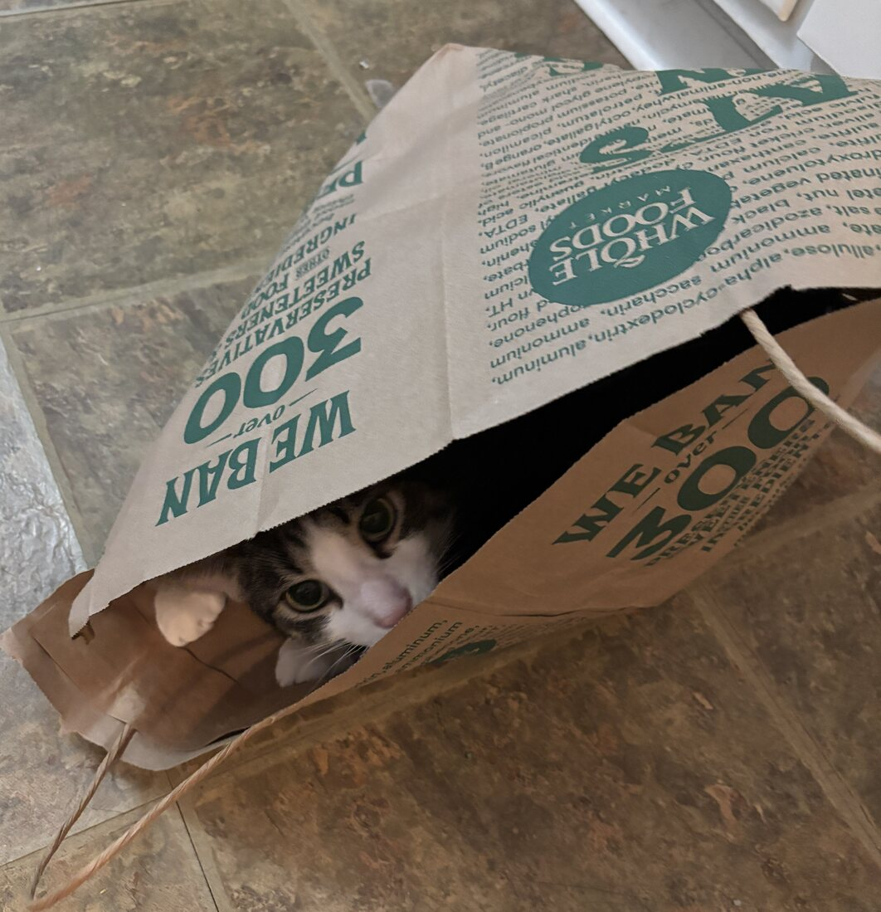

# Test Boop

2026-07-29

*Testing `boopiter`’s sweet new sharing feature.*

boop!

<figure>

<figcaption aria-hidden="true">pasted image</figcaption>
</figure>

##### 🤖Reply🤖<!-- SOLVEIT_SEPARATOR_3c455677 -->

Reply details

<ul>

<li>

Model: qwen3-vl:4b
</li>

<li>

Finish reason: stop
</li>

<li>

Tokens: 2467 prompt + 549 completion = 3016 total
</li>

</ul>

<pre style="white-space:pre-wrap">Okay, let me try to figure out how to approach this. The user provided an image of a cat in a Whole Foods bag, along with some note and prompt tags. The instruction says they want me to respond as if I'm the model, and they mention that if the task requires using the provided functions, I should write the code inside a Python code block.
&#10;First, I need to check if the user's request actually needs any of those functions. The functions listed are for reading, editing, and writing Jupyter notebooks, PDF extraction, GPU checks, and installing skills. The user's message includes an image, a note saying "Test Boop", and a prompt "boop!" with an image link.
&#10;Looking at the problem, the user is probably testing the system's ability to handle different kinds of inputs. The image is just a picture, so there's no need to process it with any of the given functions. The note and prompt are part of the context, but the actual task here might be to recognize that there's no file manipulation needed here.
&#10;Wait, the user included [img] and [note] and [prompt] tags. Maybe they want to see if I can respond to a message that's structured with those tags. But the instructions say that if the task genuinely requires one of the functions, I need to provide the code. Since the problem is about an image and some text, and the functions are for notebook operations, which aren't related to processing images, there's no need to use any of those tools here.
&#10;So the correct response is to just answer normally, without using any of the provided functions. The user might be testing if the model realizes that it doesn't need to perform file operations for this task. The key is that the user's request is about interpreting the context (the image and text), not editing notebooks or anything else.
&#10;Let me confirm: none of the functions are related to processing images or handling the image data. The functions are all for Jupyter notebook manipulations, PDF extraction, etc. The user's image is just a picture, so no tool is needed. Therefore, the correct approach is to ignore the functions and respond as a normal answer, acknowledging the image and prompt.</pre>

This is a fun image of a cat hiding in a Whole Foods grocery bag! 🐾 The
note and prompt “boop!” seem to be part of a playful test. While the
image looks like a classic “cat in a bag” moment, no file manipulation
or notebook editing is needed here—this is purely a visual context. If
you’d like to work with Jupyter notebooks or other tools from the
provided list, just let me know! 😊

